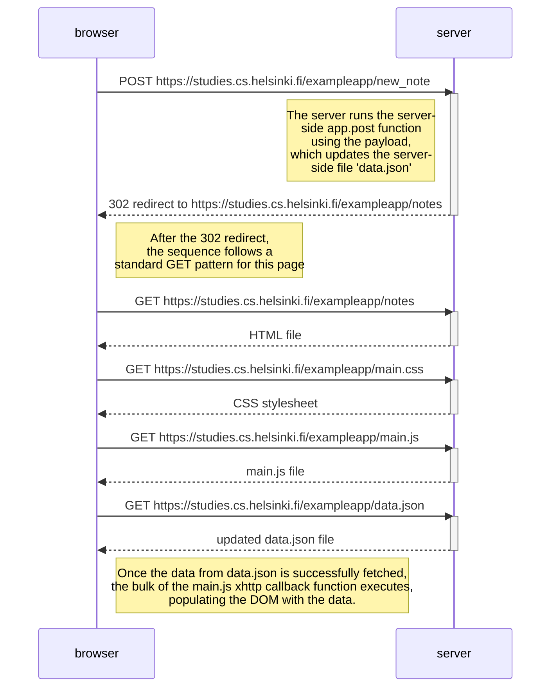

```mermaid
sequenceDiagram
    participant B as browser
    participant S as server

    B->>S: POST https://studies.cs.helsinki.fi/exampleapp/new_note
    activate S
    Note left of S: The server runs the server-<br />side app.post function <br />using the payload, <br />which updates the server-<br />side file 'data.json'
    S-->>B: 302 redirect to https://studies.cs.helsinki.fi/exampleapp/notes
    deactivate S

    Note right of B: After the 302 redirect,<br /> the sequence follows a <br />standard GET pattern for this page

    B->>S: GET https://studies.cs.helsinki.fi/exampleapp/notes
    activate S
    S-->>B: HTML file
    deactivate S

    B->>S: GET https://studies.cs.helsinki.fi/exampleapp/main.css
    activate S
    S-->>B: CSS stylesheet
    deactivate S

    B->>S: GET https://studies.cs.helsinki.fi/exampleapp/main.js
    activate S
    S-->>B: main.js file
    deactivate S

    B->>S: GET https://studies.cs.helsinki.fi/exampleapp/data.json
    activate S
    S-->>B: updated data.json file
    deactivate S

    Note right of B: Once the data from data.json is successfully fetched,<br />the bulk of the main.js xhttp callback function executes,<br />populating the DOM with the data.
```
