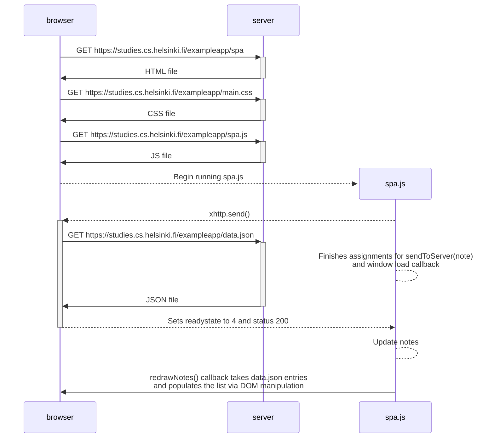

```mermaid
sequenceDiagram
    participant B as browser
    participant S as server

    B->>+S: GET https://studies.cs.helsinki.fi/exampleapp/spa
    S->>-B: HTML file

    B->>+S: GET https://studies.cs.helsinki.fi/exampleapp/main.css
    S->>-B: CSS file

    B->>+S: GET https://studies.cs.helsinki.fi/exampleapp/spa.js
    S->>-B: JS file

    create participant J as spa.js
    B-->>J: Begin running spa.js
    J-->>+B: xhttp.send()
    B->>+S: GET https://studies.cs.helsinki.fi/exampleapp/data.json
    J-->J: Finishes assignments for sendToServer(note) <br />and window load callback
    S->>-B: JSON file
    B-->>-J: Sets readystate to 4 and status 200
    J-->J: Update notes
    J->>B: redrawNotes() callback takes data.json entries<br />and populates the list via DOM manipulation
```
